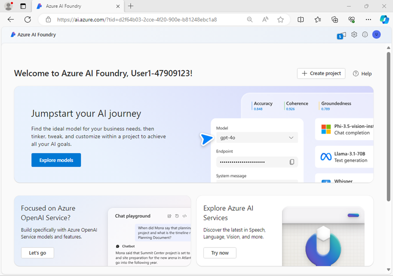
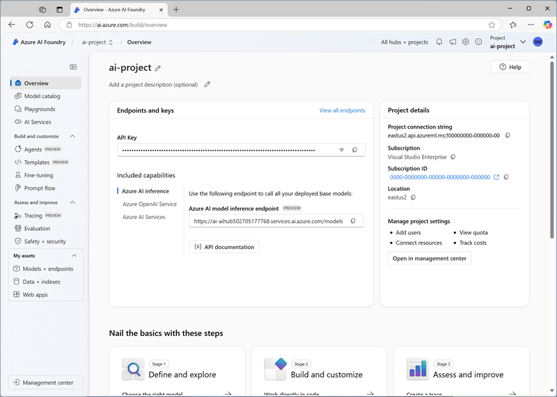

---
lab:
    title: 'Generate images with AI'
    description: 'Learn how to use a DALL-E OpenAI model to generate images.'
    status: new
---

# Generate images with AI

In this exercise, you use the the OpenAI DALL-E generative AI model to generate images. You'll develop your app by using Azure AI Foundry and the Azure OpenAI service.

This exercise takes approximately **30** minutes.

## Create an Azure AI Foundry project

Let's start by creating an Azure AI Foundry project.

1. In a web browser, open the [Azure AI Foundry portal](https://ai.azure.com) at `https://ai.azure.com` and sign in using your Azure credentials. Close any tips or quick start panes that are opened the first time you sign in, and if necessary use the **Azure AI Foundry** logo at the top left to navigate to the home page, which looks similar to the following image:

    

1. In the home page, select **+ Create project**.
1. In the **Create a project** wizard, enter a valid name for your project and if an existing hub is suggested, choose the option to create a new one. Then review the Azure resources that will be automatically created to support your hub and project.
1. Select **Customize** and specify the following settings for your hub:
    - **Hub name**: *A valid name for your hub*
    - **Subscription**: *Your Azure subscription*
    - **Resource group**: *Create or select a resource group*
    - **Location**: Select **Help me choose** and then select **dalle** in the Location helper window and use the recommended region\*
    - **Connect Azure AI Services or Azure OpenAI**: *Create a new AI Services resource*
    - **Connect Azure AI Search**: Skip connecting

    > \* Azure OpenAI resources are constrained by regional quotas. In the event of a quota limit being reached later in the exercise, there's a possibility you may need to create another resource in a different region.

1. Select **Next** and review your configuration. Then select **Create** and wait for the process to complete.
1. When your project is created, close any tips that are displayed and review the project page in Azure AI Foundry portal, which should look similar to the following image:

    

## Deploy a DALL-E model

Now you're ready to deploy a DALL-E model to support image-generation.

1. In the toolbar at the top right of your Azure AI Foundry project page, use the **Preview features** icon to enable the **Deploy models to Azure AI model inference service** feature. This feature ensures your model deployment is available to the Azure AI Inference service, which you'll use in your application code.
1. In the pane on the left for your project, in the **My assets** section, select the **Models + endpoints** page.
1. In the **Models + endpoints** page, in the **Model deployments** tab, in the **+ Deploy model** menu, select **Deploy base model**.
1. Search for the **dall-e-3** model in the list, and then select and confirm it.
1. Agree to the license agreement if prompted, and then deploy the model with the following settings by selecting **Customize** in the deployment details:
    - **Deployment name**: *A valid name for your model deployment*
    - **Deployment type**: Standard
    - **Deployment details**: *Use the default settings*
1. Wait for the deployment provisioning state to be **Completed**.

## Test the model in the playground

Before creating a client application, let's test the DALL-E model in the playground.

1. In the page for the DALL-E model you deployed, select **Open in playground** (or in the **Playgrounds** page, open the **Images playground**).
1. Ensure your DALL-E model deployment is selected. Then, in the **Prompt** box, enter a prompt such as `Create an image of an robot eating spaghetti`.
1. Review the resulting image in the playground:

    

1. Enter a follow-up prompt, such as `Show the robot in a restaurant` and review the resulting image.
1. Continue testing with new prompts to refine the image until you are happy with it.

## Create a client application

The model seems to work in the playground. Now you can use the Azure OpenAI SDK to use it in a client application.

> **Tip**: You can choose to develop your solution using Python or Microsoft C#. Follow the instructions in the appropriate section for your chosen language.

### Prepare the application configuration

1. In the Azure AI Foundry portal, view the **Overview** page for your project.
1. In the **Project details** area, note the **Project connection string**. You'll use this connection string to connect to your project in a client application.
1. Open a new browser tab (keeping the Azure AI Foundry portal open in the existing tab). Then in the new tab, browse to the [Azure portal](https://portal.azure.com) at `https://portal.azure.com`; signing in with your Azure credentials if prompted.
1. Use the **[\>_]** button to the right of the search bar at the top of the page to create a new Cloud Shell in the Azure portal, selecting a ***PowerShell*** environment. The cloud shell provides a command line interface in a pane at the bottom of the Azure portal.

    > **Note**: If you have previously created a cloud shell that uses a *Bash* environment, switch it to ***PowerShell***.

5. In the cloud shell toolbar, in the **Settings** menu, select **Go to Classic version** (this is required to use the code editor).

    **<font color="red">Ensure you've switched to the classic version of the cloud shell before continuing.</font>**

1. In the cloud shell pane, enter the following commands to clone the GitHub repo containing the code files for this exercise (type the command, or copy it to the clipboard and then right-click in the command line and paste as plain text):

    ```
    rm -r mslearn-openai -f
    git clone https://github.com/microsoftlearning/mslearn-openai mslearn-openai
    ```

    > **Tip**: As you paste commands into the cloudshell, the ouput may take up a large amount of the screen buffer. You can clear the screen by entering the `cls` command to make it easier to focus on each task.

1. After the repo has been cloned, navigate to the language-specific folder containing the application code files, based on the programming language of your choice (Python or C#):  

    **Python**

    ```
   cd mslearn-openai/Labfiles/03-image-generation/Python
    ```

    **C#**

    ```
   cd mslearn-openai/Labfiles/03-image-generation/CSharp
    ```

1. In the cloud shell command line pane, enter the following command to install the libraries you'll use:

    **Python**

    ```
   python -m venv labenv
   ./labenv/bin/Activate.ps1
   pip install python-dotenv azure-identity azure-ai-projects openai requests
    ```

    **C#**

    ```
   dotnet add package Azure.Identity
   dotnet add package Azure.AI.Projects --prerelease
   dotnet add package Azure.AI.OpenAI
    ```

1. Enter the following command to edit the configuration file that has been provided:

    **Python**

    ```
   code .env
    ```

    **C#**

    ```
   code appsettings.json
    ```

    The file is opened in a code editor.

1. In the code file, replace the **your_project_endpoint** placeholder with the connection string for your project (copied from the project **Overview** page in the Azure AI Foundry portal), and the **your_model_deployment** placeholder with the name you assigned to your dall-e-3 model deployment.
1. After you've replaced the placeholders, use the **CTRL+S** command to save your changes and then use the **CTRL+Q** command to close the code editor while keeping the cloud shell command line open.

### Write code to connect to your project and chat with your model

> **Tip**: As you add code, be sure to maintain the correct indentation.

1. Enter the following command to edit the code file that has been provided:

    **Python**

    ```
   code dalle-client.py
    ```

    **C#**

    ```
   code Program.cs
    ```

1. In the code file, note the existing statements that have been added at the top of the file to import the necessary SDK namespaces. Then, under the comment **Add references**, add the following code to reference the namespaces in the libraries you installed previously:

    **Python**

    ```python
   # Add references
   from dotenv import load_dotenv
   from azure.identity import DefaultAzureCredential
   from azure.ai.projects import AIProjectClient
   from openai import AzureOpenAI
   import requests
    ```

    **C#**

    ```csharp
   // Add references
   using Azure.Identity;
   using Azure.AI.Projects;
   using Azure.AI.OpenAI;
   using OpenAI.Images;
    ```

1. In the **main** function, under the comment **Get configuration settings**, note that the code loads the project connection string and model deployment name values you defined in the configuration file.
1. Under the comment **Initialize the project client**, add the following code to connect to your Azure AI Foundry project using the Azure credentials you are currently signed in with:

    **Python**

    ```python
   # Initialize the project client
   project_client = AIProjectClient.from_connection_string(
        conn_str=project_connection,
        credential=DefaultAzureCredential())
    ```

    **C#**

    ```csharp
   // Initialize the project client
   var projectClient = new AIProjectClient(project_connection,
                        new DefaultAzureCredential());
    ```

1. Under the comment **Get an OpenAI client**, add the following code to create a client object for chatting with a model:

    **Python**

    ```python
   # Get an OpenAI client
   openai_client = project_client.inference.get_azure_openai_client(api_version="2024-06-01")

    ```

    **C#**

    ```csharp
   // Get an OpenAI client
   ConnectionResponse connection = projectClient.GetConnectionsClient().GetDefaultConnection(ConnectionType.AzureOpenAI, withCredential: true);

   var connectionProperties = connection.Properties as ConnectionPropertiesApiKeyAuth;

   AzureOpenAIClient openAIClient = new(
        new Uri(connectionProperties.Target),
        new AzureKeyCredential(connectionProperties.Credentials.Key));

   ImageClient openAIimageClient = openAIClient.GetImageClient(model_deployment);

    ```

1. Note that the code includes a loop to allow a user to input a prompt until they enter "quit". Then in the loop section, under the comment **Generate an image**, add the following code to submit the prompt and retrieve the URL for the generated image from your model:

    **Python**

    ```python
   # Generate an image
   result = openai_client.images.generate(
        model=model_deployment,
        prompt=input_text,
        n=1
    )

    json_response = json.loads(result.model_dump_json())
    image_url = json_response["data"][0]["url"] 
    ```

    **C#**

    ```csharp
   // Generate an image
   var imageGeneration = await openAIimageClient.GenerateImageAsync(
            input_text,
            new ImageGenerationOptions()
            {
                Size = GeneratedImageSize.W1024xH1024
            }
   );
   imageUrl= imageGeneration.Value.ImageUri;
    ```

1. Note that the code in the remainder of the **main** function passes the image URL and a filename to a provided function, which downloads the generated image and saves it as a .png file.

1. Use the **CTRL+S** command to save your changes to the code file and then use the **CTRL+Q** command to close the code editor while keeping the cloud shell command line open.

### Run the client application

1. In the cloud shell command line pane, enter the following command to run the app:

    **Python**

    ```
   python dalle-client.py
    ```

    **C#**

    ```
   dotnet run
    ```

1. When prompted, enter a request for an image, such as `Create an image of a robot eating pizza`. After a moment or two, the app should confirm that the image has been saved.
1. Try a few more prompts. When you're finished, enter `quit` to exit the program.

    > **Note**: In this simple app, we haven't implemented logic to retain conversation history; so the model will treat each prompt as a new request with no context of the previous prompt.

1. To download and view the images that were generated by your app, use the cloud shell **download** command - specifying the .png file that was generated:

    ```
   download ./images/image_1.png
    ```

    The download command creates a popup link at the bottom right of your browser, which you can select to download and open the file.

## Summary

In this exercise, you used Azure AI Foundry and the Azure OpenAI SDK to create a client application uses a DALL-E model to generate images.

## Clean up

If you've finished exploring DALL-E, you should delete the resources you have created in this exercise to avoid incurring unnecessary Azure costs.

1. Return to the browser tab containing the Azure portal (or re-open the [Azure portal](https://portal.azure.com) at `https://portal.azure.com` in a new browser tab) and view the contents of the resource group where you deployed the resources used in this exercise.
1. On the toolbar, select **Delete resource group**.
1. Enter the resource group name and confirm that you want to delete it.