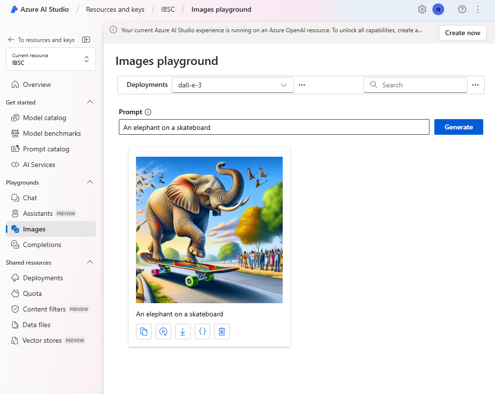
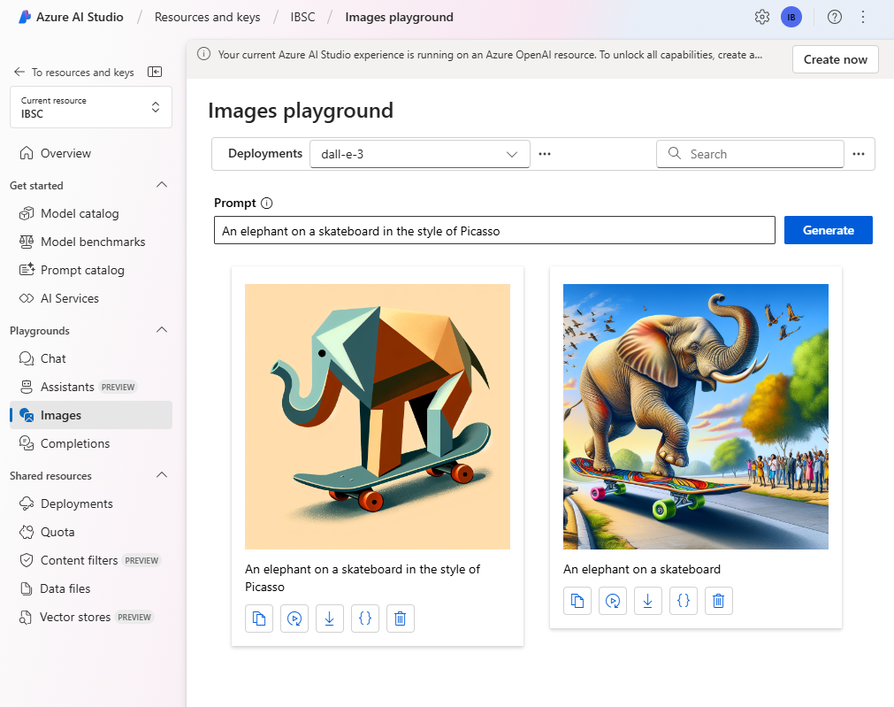

---
lab:
    title: 'Generate images with a DALL-E model'
---

# Generate images with a DALL-E model

The Azure OpenAI Service includes an image-generation model named DALL-E. You can use this model to submit natural language prompts that describe a desired image, and the model will generate an original image based on the description you provide.

In this exercise, you'll use a DALL-E version 3 model to generate images based on natural language prompts.

This exercise will take approximately **25** minutes.

## Provision an Azure OpenAI resource

Before you can use Azure OpenAI to generate images, you must provision an Azure OpenAI resource in your Azure subscription. The resource must be in a region where DALL-E models are supported.

1. Sign into the **Azure portal** at `https://portal.azure.com`.
1. Create an **Azure OpenAI** resource with the following settings:
    - **Subscription**: *Select an Azure subscription that has been approved for access to the Azure OpenAI service, including DALL-E*
    - **Resource group**: *Choose or create a resource group*
    - **Region**: *Choose either **East US** or **Sweden Central***\*
    - **Name**: *A unique name of your choice*
    - **Pricing tier**: Standard S0

    > \* DALL-E 3 models are only available in Azure OpenAI service resources in the **East US** and **Sweden Central** regions.

1. Wait for deployment to complete. Then go to the deployed Azure OpenAI resource in the Azure portal.
1. On the **Overview** page for your Azure OpenAI resource, scroll down to the **Get Started** section and select the button to go to **AI Studio**.
1. In Azure AI Studio, in the pane on the left, select the **Deployments** page and view your existing model deployments. If you don't already have one for DALL-E 3, create a new deployment of the **dall-e-3** model with the following settings:
    - **Deployment name**: dalle3
    - **Model version**: *Use default version*
    - **Deployment type**: Standard
    - **Capacity units**: 1K
    - **Content filter**: Default
    - **Enable dynamic quota**: Disabled
1. One deployed, navigate back to the **Images** page in the left pane.

## Explore image-generation in the images playground

You can use the Images playground in **Azure AI Studio** to experiment with image generation.

1. In the **Images playground** section, your deployment of DALL-E 3 should be automatically selected. If not, select it from the deployment dropdown.
1. In the **Prompt** box, enter a description of an image you'd like to generate. For example, `An elephant on a skateboard` Then select **Generate** and view the image that is generated.

    

1. Modify the prompt to provide a more specific description. For example `An elephant on a skateboard in the style of Picasso`. Then generate the new image and review the results.

    

## Use the REST API to generate images

The Azure OpenAI service provides a REST API that you can use to submit prompts for content generation - including images generated by a DALL-E model.

### Prepare to develop an app in Visual Studio Code

Now let's explore how you could build a custom app that uses Azure OpenAI service to generate images. You'll develop your app using Visual Studio Code. The code files for your app have been provided in a GitHub repo.

> **Tip**: If you have already cloned the **mslearn-openai** repo, open it in Visual Studio code. Otherwise, follow these steps to clone it to your development environment.

1. Start Visual Studio Code.
2. Open the palette (SHIFT+CTRL+P) and run a **Git: Clone** command to clone the `https://github.com/MicrosoftLearning/mslearn-openai` repository to a local folder (it doesn't matter which folder).
3. When the repository has been cloned, open the folder in Visual Studio Code.

    > **Note**: If Visual Studio Code shows you a pop-up message to prompt you to trust the code you are opening, click on **Yes, I trust the authors** option in the pop-up.

4. Wait while additional files are installed to support the C# code projects in the repo.

    > **Note**: If you are prompted to add required assets to build and debug, select **Not Now**.

### Configure your application

Applications for both C# and Python have been provided. Both apps feature the same functionality. First, you'll add the endpoint and key for your Azure OpenAI resource to the app's configuration file.

1. In Visual Studio Code, in the **Explorer** pane, browse to the **Labfiles/05-image-generation** folder and expand the **CSharp** or **Python** folder depending on your language preference. Each folder contains the language-specific files for an app into which you're you're going to integrate Azure OpenAI functionality.
2. In the **Explorer** pane, in the **CSharp** or **Python** folder, open the configuration file for your preferred language

    - **C#**: appsettings.json
    - **Python**: .env
    
3. Update the configuration values to include the **endpoint** and **key** from the Azure OpenAI resource you created (available on the **Keys and Endpoint** page for your Azure OpenAI resource in the Azure portal).
4. Save the configuration file.

### View application code

Now you're ready to explore the code used to call the REST API and generate an image.

1. In the **Explorer** pane, select the main code file for your application:

    - C#: `Program.cs`
    - Python: `generate-image.py`

2. Review the code that the file contains, noting the following key features:
    - The code makes an https request to the endpoint for your service, including the key for your service in the header. Both of these values are obtained from the configuration file.
    - The request includes some parameters, including the prompt from on the image should be based, the number of images to generate, and the size of the generated image(s).
    - The response includes a revised prompt that the DALL-E model extrapolated from the user-provided prompt to make it more descriptive, and the URL for the generated image.
    
    > **Important**: If you named your deployment anything other than the recommended *dalle3*, you'll need to update the code to use the name of your deployment.

### Run the app

Now that you've reviewed the code, it's time to run it and generate some images.

1. Right-click the **CSharp** or **Python** folder containing your code files and open an integrated terminal. Then enter the appropriate command to run your application:

   **C#**
   ```
   dotnet run
   ```
   
   **Python**
   ```
   pip install requests
   python generate-image.py
   ```

3. When prompted, enter a description for an image. For example, *A giraffe flying a kite*.

4. Wait for the image to be generated - a hyperlink will be displayed in the terminal pane. Then select the hyperlink to open a new browser tab and review the image that was generated.

   > **TIP**: If the app doesn't return a response, wait a minute and try again. Newly deployed resources can take up to 5 minutes to become available.

5. Close the browser tab containing the generated image and re-run the app to generate a new image with a different prompt.

## Clean up

When you're done with your Azure OpenAI resource, remember to delete the resource in the **Azure portal** at `https://portal.azure.com`.
