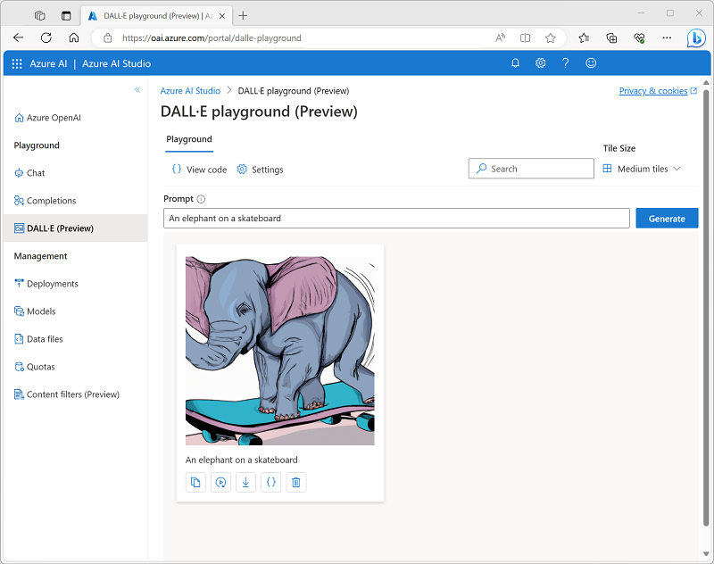
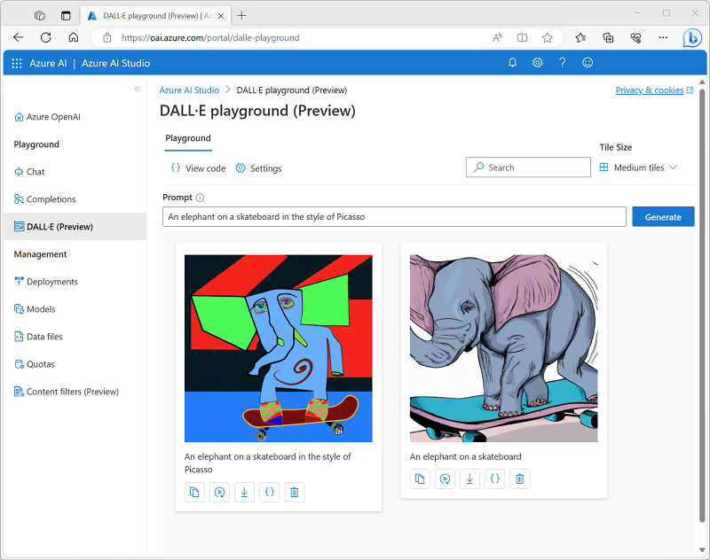

---
lab:
    title: 'Generate images with a DALL-E model'
---

# Generate images with a DALL-E model

The Azure OpenAI Service includes an image-generation model named DALL-E. You can use this model to submit natural language prompts that describe a desired image, and the model will generate an original image based on the description you provide.

This exercise will take approximately **25** minutes.

## Before you start

You will need an Azure subscription that has been approved for access to the Azure OpenAI service, including DALL-E. If you have previously applied for access to the Azure openAI service, you may need to submit another application to gain access to DALL-E.

- To sign up for a free Azure subscription, visit [https://azure.microsoft.com/free](https://azure.microsoft.com/free).
- To request access to the Azure OpenAI service, visit [https://aka.ms/oaiapply](https://aka.ms/oaiapply).

## Provision an Azure OpenAI resource

Before you can use Azure OpenAI models, you must provision an Azure OpenAI resource in your Azure subscription.

1. Sign into the [Azure portal](https://portal.azure.com).
2. Create an **Azure OpenAI** resource with the following settings:
    - **Subscription**: An Azure subscription that has been approved for access to the Azure OpenAI service.
    - **Resource group**: Create a new resource group with a name of your choice.
    - **Region**: Choose any available region.
    - **Name**: A unique name of your choice.
    - **Pricing tier**: Standard S0
3. Wait for deployment to complete. Then go to the deployed Azure OpenAI resource in the Azure portal.
4. Navigate to **Keys and Endpoint** page. You can retrieve the unique endpoint and authentication keys for your service from here - you'll need these later!

## Explore image-generation in the DALL-E playground

You can use the DALL-E playground in **Azure OpenAI Studio** to experiment with image-generation.

1. In the Azure portal, on the **Overview** page for your Azure OpenAI resource, use the **Explore** button to open Azure OpenAI Studio in a new browser tab. Alternatively, navigate to [Azure OpenAI Studio](https://oai.azure.com/?azure-portal=true) directly.
2. Select the **DALL-E Playground**.
3. In the **Prompt** box, enter a description of an image you'd like to generate. For example, *An elephant on a skateboard*. Then select **Generate** and view the image that is generated.

    

4. Modify the prompt to provide a more specific description. For example *An elephant on a skateboard in the style of Picasso*. Then generate the new image and review the results.

    

## Use the REST API to generate images

The Azure OpenAI service provides a REST API that you can use to submit prompts for content generation - including images generated by a DALL-E model.

### Prepare the app environment

In this exercise, you'll use a simple Python or Microsoft C# app to generate images by calling the REST API. You'll run the code in the cloud shell console interface in the Azure portal.

1. In the [Azure portal](https://portal.azure.com?azure-portal=true), select the **[>_]** (*Cloud Shell*) button at the top of the page to the right of the search box. A Cloud Shell pane will open at the bottom of the portal. 

    

2. The first time you open the Cloud Shell, you may be prompted to choose the type of shell you want to use (*Bash* or *PowerShell*). Select **Bash**. If you don't see this option, skip the step.  

3. If you're prompted to create storage for your Cloud Shell, ensure your subscription is specified and select **Create storage**. Then wait a minute or so for the storage to be created.

    > **Note**: If you already have a cloud shell set up in your Azure subscription, you may need to use the **Reset user settings** option in the ⚙️ menu to ensure the latest versions of Python and the .NET Framework are installed.

4. Make sure the type of shell indicated on the top left of the Cloud Shell pane is switched to *Bash*. If it's *PowerShell*, switch to *Bash* by using the drop-down menu.

5. Once the terminal starts, enter the following command to download the application code you are going to work with.

    ```bash
   rm -r azure-openai -f
   git clone https://github.com/MicrosoftLearning/mslearn-openai azure-openai
    ```

    The files are downloaded to a folder named **azure-openai**. Applications for both C# and Python have been provided. Both apps feature the same functionality.

6. Navigate to the folder for the language you want to use by running the appropriate command.

    **Python**

    ```bash
   cd azure-openai/Labfiles/05-image-generation/Python
    ```

    **C#**

    ```bash
   cd azure-openai/Labfiles/05-image-generation/CSharp
    ```

7. Use the following command to open the built-in code editor and see the code files you will be working with.

    ```bash
   code .
    ```

### Configure your application

The application uses a configuration file to store the details needed to connect to your Azure OpenAI service account.

1. In the code editor, select the configuration file for your app - depending on your language preference.

    - C#: `appsettings.json`
    - Python: `.env`
    
2. Update the configuration values to include the **Endpoint** and **Key1** for your Azure OpenAI service and then save the file.

    > **Tip**: You can adjust the split at the top of the cloud shell pane to see the Azure portal, and get the endpoint and key values from the **Keys and Endpoint** page for your Azure OpenAI service.

3. If you are using **Python**, you'll also need to install the **python-dotenv** package used to read the configuration file. In the console prompt pane, ensure the current folder is **~/azure-openai/Labfiles/05-image-generation/Python**. Then enter this command:

    ```bash
   pip install python-dotenv
    ```

### View application code

Now you're ready to explore the code used to call the REST API and generate an image.

1. In the code editor pane, select the main code file for your application:

    - C#: `Program.cs`
    - Python: `generate-image.py`

2. Review the code that the file contains, noting the following key features:
    - The code makes https requests to the endpoint for your service, including the key for your service in the header. Both of these values are obtained from the configuration file.
    - The process consists of <u>two</u> REST requests: One to initiate the image-generation request, and another to retrieve the results.
    The initial request includes the following data:
        - The user-provided prompt that describes the image to be generated
        - The number of images to be generated (in this case, 1)
        - The resolution (size) of the image to be generated.
    - The response header from the initial request includes an **operation-location** value that is used for the subsequent callback to get the results.
    - The code polls the callback URL until the status of the image-generation task is *succeeded*, and then extracts and displays a URL for the generated image.

### Run the app

Now that you've reviewed the code, it's time to run it and generate some images.

1. In the console prompt pane, enter the appropriate command to run your application:

    **Python**

    ```bash
   python generate-image.py
    ```

    **C#**

    ```bash
   dotnet run
    ```

2. When prompted, enter a description for an image. For example, *A giraffe flying a kite*.

3. Wait for the image to be generated - a hyperlink will be displayed in the console pane. Then select the hyperlink to open a new browser tab and review the image that was generated.

4. Close the tab containing the generated image and re-run the app to generate a new image with a different prompt.

## Clean up

When you're done with your Azure OpenAI resource, remember to delete the resource in the [Azure portal](https://portal.azure.com/?azure-portal=true).
